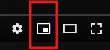

# YouTube MiniPlayer Extension



## 🎯 Bring Back the MiniPlayer Button

A browser extension that restores the missing miniplayer button to YouTube's video player interface. This extension ensures you can always access YouTube's miniplayer functionality with a single click.

## ✨ Features

- **One-Click MiniPlayer Access**: Adds a dedicated miniplayer button to YouTube's video controls
- **Smart Context Menu Handling**: Automatically initializes YouTube's context menu system when needed
- **Seamless Integration**: Blends perfectly with YouTube's native UI design
- **No Performance Impact**: Lightweight and efficient implementation
- **Cross-Browser Compatible**: Works with Chrome, Firefox (109+), Edge, and other Chromium-based browsers

## 🚀 Installation

### Load as Unpacked Extension (Development)

1. Download or clone this repository
2. Open your browser's extension management page:
   - **Chrome**: `chrome://extensions/`
   - **Firefox**: `about:addons`
   - **Edge**: `edge://extensions/`
3. Enable "Developer mode" (Chrome/Edge) or "Debug Add-ons" (Firefox)
4. Click "Load unpacked" and select the extension folder
5. The extension will be installed and active

## 🎮 How It Works

The extension works by:

1. **Injecting a Custom Button**: Adds a miniplayer button to YouTube's video control bar
2. **Smart Context Menu Detection**: Checks if YouTube's context menu system is initialized
3. **Automatic Initialization**: If needed, simulates a right-click to initialize the context menu
4. **Immediate Cleanup**: Hides the context menu instantly to maintain a clean interface
5. **MiniPlayer Activation**: Triggers YouTube's native miniplayer functionality

## 🔧 Technical Details

### Files Structure

```
bring_back_yt_miniplayer/
├── manifest.json          # Extension manifest
├── content.js             # Main content script
├── icons/
│   └── icon.png          # Miniplayer icon
└── README.md             # This file
```

### Key Components

- **`manifest.json`**: Defines extension permissions and metadata
- **`content.js`**: Main script that injects the miniplayer button
- **`icons/icon.png`**: Custom PNG icon for the miniplayer button

### Browser Permissions

- `activeTab`: Required to interact with YouTube pages
- `scripting`: Needed to inject content scripts

### Browser Compatibility

- **Chrome**: Full support (Manifest V3)
- **Edge**: Full support (Chromium-based)
- **Firefox**: Supported (Firefox 109+ with Manifest V3)
- **Other Chromium browsers**: Should work with Manifest V3 support

## 🛠️ Troubleshooting

### Button Not Appearing

1. Refresh the YouTube page
2. Check if the extension is enabled in your browser
3. Try disabling and re-enabling the extension

## 🤝 Contributing

Contributions are welcome! Please feel free to submit a Pull Request. For major changes, please open an issue first to discuss what you would like to change.
